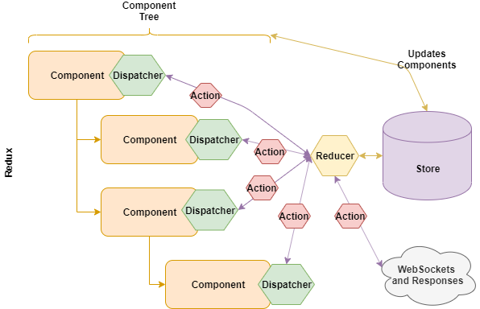
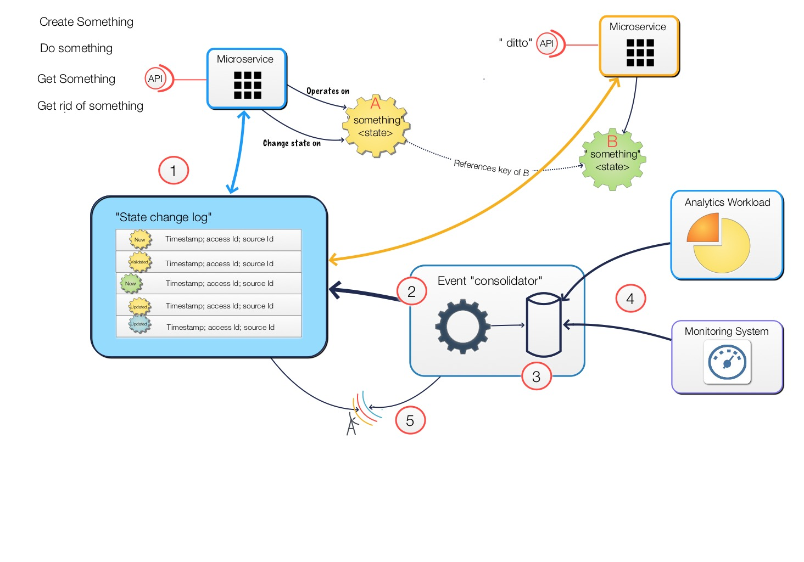
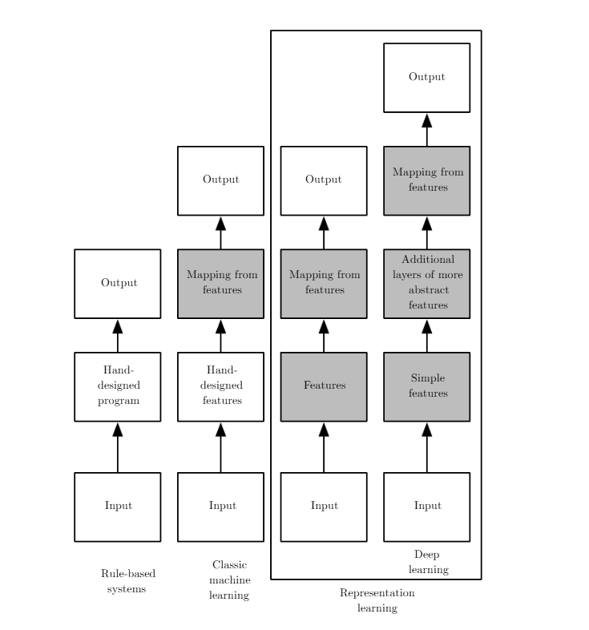
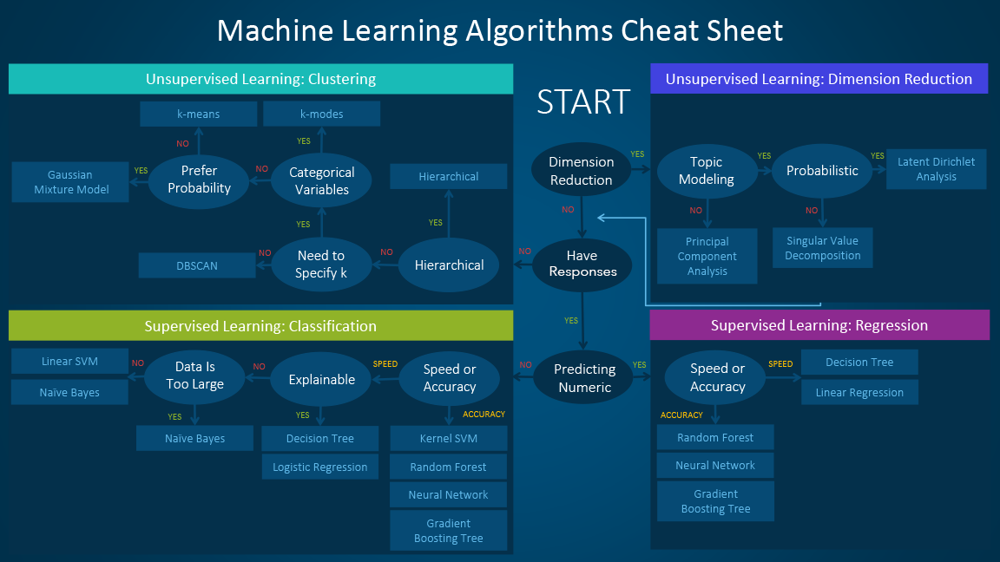
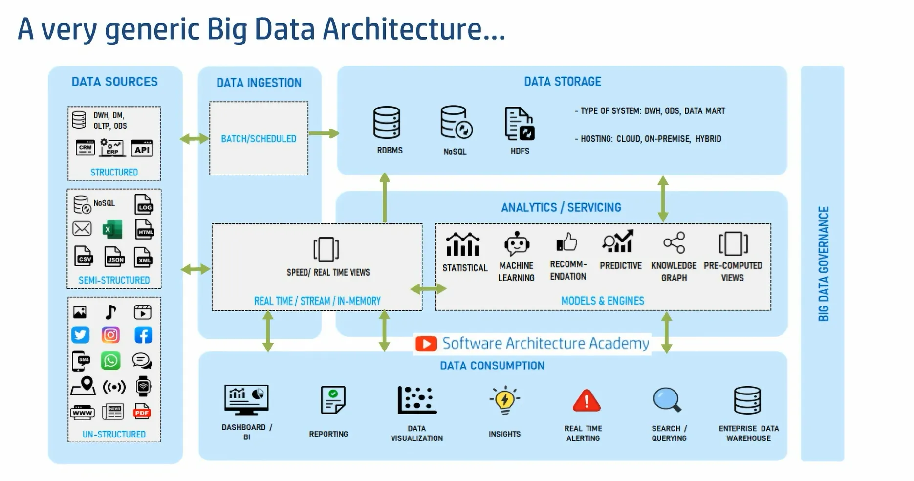

# Harness the power of data and top-notch AI

*By Sachin Dixit*

## What is Data?

## Data, Data Structures and Big Data

- Data: A slice of reality, a point in time
- Data Structure: formal arrangement of the data
- What is Data Modeling?
- Other than text?
  - Images
  - Voice
  - Videos
  - Geospatial
  - Many more
- What do we mean by unstructured data?

## Data meet the Database

- What happens to your data structure in a database?
- Issues of fitment and loss of detail
- Internal DS used by db (for academic interest)
- Different DB/Storage types?

## Meet Einstein

<table>
<tr>
<td valign="top">

- Mutable or not?
- What is state?
- Time sensitivity!
- Batch vs Streaming
- Event time vs process time vs windowing
- AWS style data centers

</td>
<td valign="top">

  

</td>
</tr>
</table>

Sources:

- React: https://medium.com/better-programming/react-state-of-the-state-e30e98abdb01
- Microservices: https://garysmicroservices.wordpress.com/2016/01/06/event-logs-state-flows-microservices-how-do-these-relate/

## Data Processing Systems

- Right Data
- Quality data
- Relevant data
- Available data

## Nature of AI System

Source: https://www.deeplearningbook.org/contents/intro.html

## Data needs of ML Algos

Copyright: https://blogs.sas.com/content/subconsciousmusings/2020/12/09/machine-learning-algorithm-use/

## Data \_ \_ \_ Architecture

Copyright: https://www.youtube.com/watch?v=rvqCqK2Lpjg&list=TLPQMjQwMzIwMjTa5wH3VRpIKA&index=2

## What about these terms?

- NLP or Machine Vision
- ML vs LLM
- GenAI
- Your favorite Blah Blah

## Inspiring Quotes

- Data is abundant, intelligence is scarce
- From Data towards Intelligence
- Turns noise into prediction
- AI turns data into decisions. It doesn't just analyze—it learns, predicts, and acts faster than any human ever could
- Don't just collect data. Make it count.
- Zero-latency decisions in business operations.
- AI agents collaborating with us in real time.
- Data and AI, when combined effectively, can unlock extraordinary possibilities

## Finding your use cases

- Data Needs
  - Representation
  - Retrieval
  - Processing
  - Storage
  - Access and Availability
- AI Questions
  - What if
  - Why can't we
  - Can we somehow
  - What does this mean
  - Does it mean anything at all?
- AI is Augmentation, not replacement

## Further reading

- http://www.r2d3.us/visual-intro-to-machine-learning-part-1/
- http://www.r2d3.us/visual-intro-to-machine-learning-part-2
- https://blogs.sas.com/content/subconsciousmusings/2020/12/09/machine-learning-algorithm-use/
- https://www.deeplearningbook.org/contents/intro.html
- https://www.youtube.com/watch?v=rvqCqK2Lpjg&list=TLPQMjQwMzIwMjTa5wH3VRpIKA&index=2
